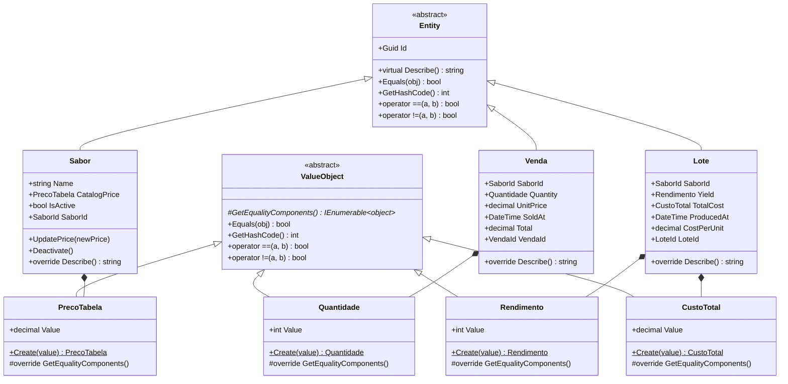
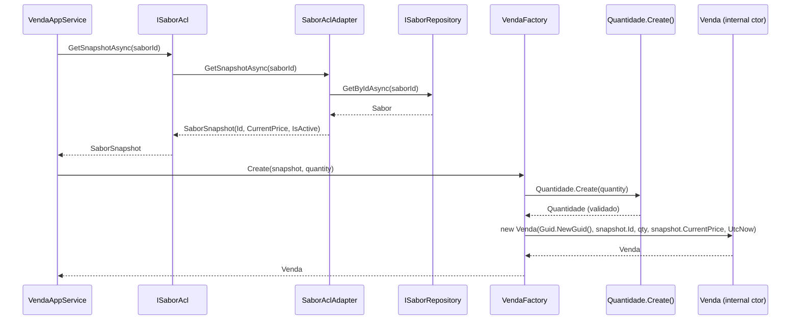

# CookieStore — Diagrama de Domínio

## 1. Hierarquia de classes (OOP)

---

## 2. Bounded Contexts e Context Map

```mermaid
graph TB
    subgraph SK["SharedKernel (Shared Kernel)"]
        Sabor["Sabor (Aggregate Root)"]
        ISaborRepo["ISaborRepository"]
        PrecoTabela["PrecoTabela (VO)"]
        SaborId["SaborId (ID)"]
        EntityBase["Entity (abstract)"]
        VOBase["ValueObject (abstract)"]
    end

    subgraph V["Vendas BC (Core Domain)"]
        VendaAgg["Venda (Aggregate Root)"]
        VendaFactory["VendaFactory"]
        RelSvc["RelatorioService (Domain Service)"]
        ISaborAcl["ISaborAcl (ACL interface)"]
        SaborSnap["SaborSnapshot (ACL read model)"]
        IVendaRepo["IVendaRepository"]
        Quantidade["Quantidade (VO)"]
    end

    subgraph P["Producao BC (Supporting Domain)"]
        LoteAgg["Lote (Aggregate Root)"]
        LoteFactory["LoteFactory"]
        ILoteRepo["ILoteRepository"]
        Rendimento["Rendimento (VO)"]
        CustoTotal["CustoTotal (VO)"]
    end

    subgraph APP["Application Layer"]
        SaborSvc["SaborAppService"]
        VendaSvc["VendaAppService"]
        LoteSvc["LoteAppService"]
        RelAppSvc["RelatorioAppService"]
        AclAdapter["SaborAclAdapter (ACL impl)"]
    end

    subgraph INFRA["Infrastructure Layer"]
        SaborRepo["SaborRepository"]
        VendaRepo["VendaRepository"]
        LoteRepo["LoteRepository"]
        DbCtx["CookieDbContext"]
    end

    %% Shared Kernel usage
    Sabor --> SaborId
    Sabor --> PrecoTabela
    VendaAgg --> SaborId
    LoteAgg --> SaborId

    %% ACL boundary
    AclAdapter -->|"usa"| ISaborRepo
    AclAdapter -->|"produz"| SaborSnap
    AclAdapter -.->|"implementa"| ISaborAcl
    VendaFactory -->|"recebe"| SaborSnap
    VendaSvc -->|"injeta"| ISaborAcl

    %% RelatorioService crosses BCs
    RelSvc -->|"usa"| IVendaRepo
    RelSvc -->|"usa"| ILoteRepo

    %% Application wiring
    SaborSvc --> ISaborRepo
    LoteSvc --> ILoteRepo
    RelAppSvc --> RelSvc

    %% Infrastructure implements Domain interfaces
    SaborRepo -.->|"implementa"| ISaborRepo
    VendaRepo -.->|"implementa"| IVendaRepo
    LoteRepo -.->|"implementa"| ILoteRepo
    SaborRepo --> DbCtx
    VendaRepo --> DbCtx
    LoteRepo --> DbCtx
```

---

## 3. Factories e criação de Aggregates

---

## 4. Testes e cobertura

| Projeto de teste | O que cobre | Testes |
|---|---|---|
| `CookieStore.Tests/SharedKernel` | Sabor, PrecoTabela, Entity, ValueObject | Unitários puros |
| `CookieStore.Tests/Vendas` | Venda, VendaFactory, RelatorioService, VendaAppService, SaborAclAdapter | Unitários + mocks |
| `CookieStore.Tests/Producao` | Lote, LoteFactory, LoteAppService | Unitários + mocks |
| `CookieStore.Tests/Relatorio` | RelatorioAppService | Unitários + mocks |
| `CookieStore.Tests/Architecture` | Regras de dependência entre camadas DDD | Arquiteturais (NetArchTest) |
